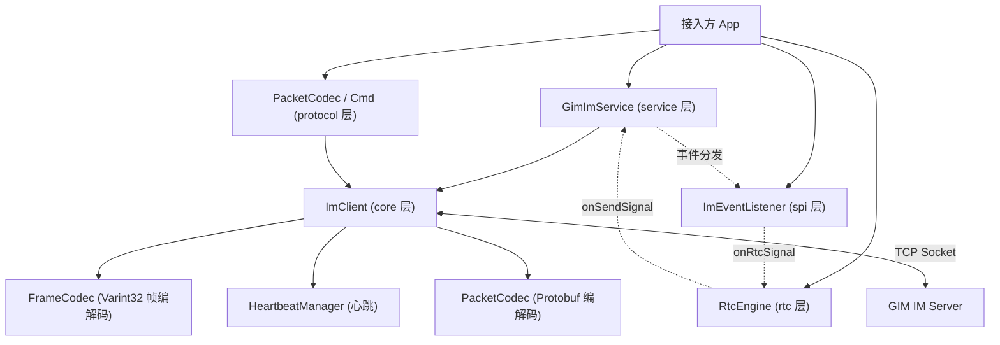
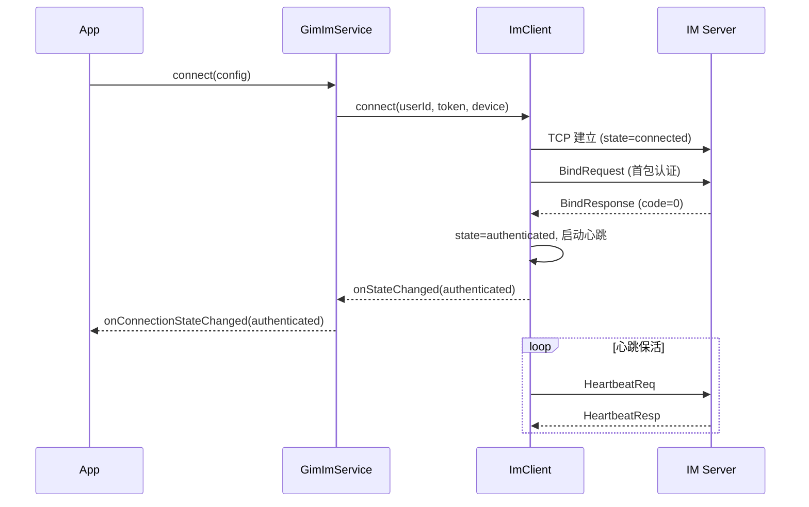
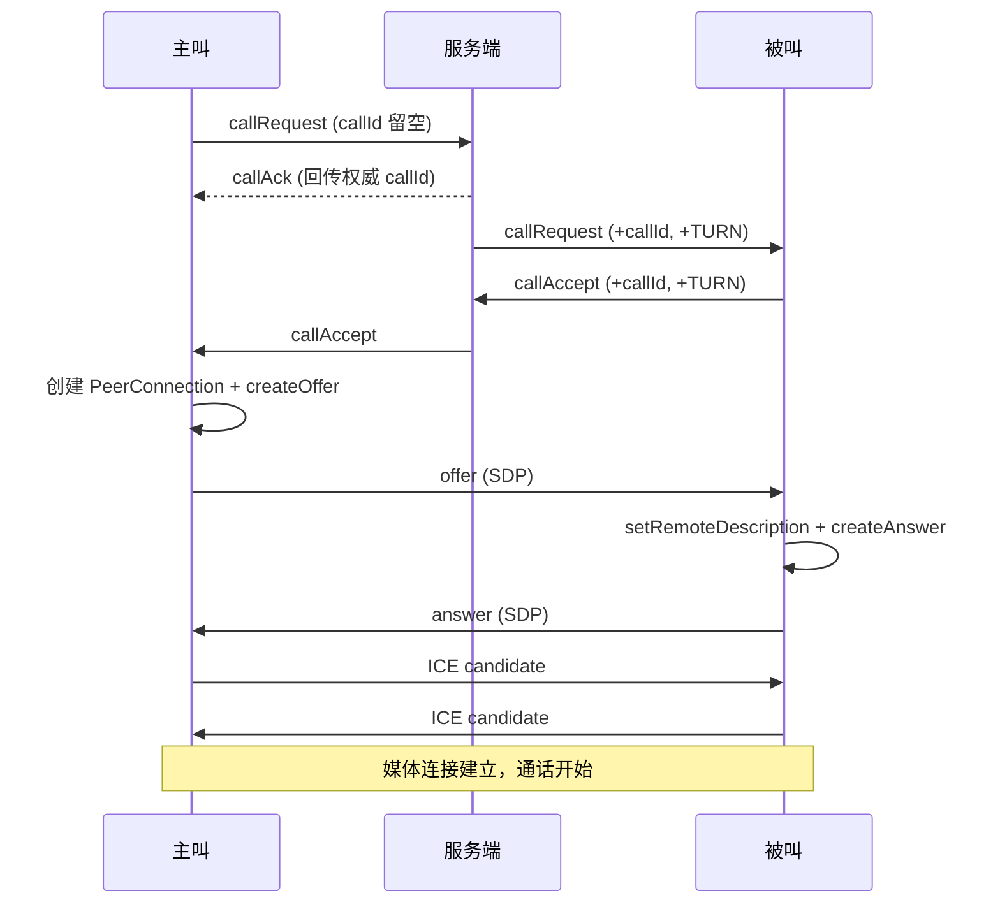

# GIM IM SDK — Flutter 接入文档

> 基于 **TCP + Protobuf + Varint32** 帧编码的 Flutter 即时通讯核心能力 SDK。
>
> SDK 只负责**通信层**（连接管理、消息收发、心跳重连、WebRTC 信令与媒体），**不包含业务逻辑**（数据库、会话管理、UUID 生成、UI 等），这些由接入方自行实现。

---

## 目录

- [1. 特性概览](#1-特性概览)
- [2. 环境要求与安装](#2-环境要求与安装)
- [3. 整体架构](#3-整体架构)
- [4. 快速开始](#4-快速开始)
- [5. 核心 API 详解](#5-核心-api-详解)
- [6. 消息收发](#6-消息收发)
- [7. 协议与数据结构](#7-协议与数据结构)
- [8. 事件监听](#8-事件监听)
- [9. 连接生命周期与前后台处理](#9-连接生命周期与前后台处理)
- [10. WebRTC 音视频通话](#10-webrtc-音视频通话)
- [11. 完整接入示例](#11-完整接入示例)
- [12. 常见问题（FAQ）](#12-常见问题faq)

---

## 1. 特性概览

| 能力 | 说明 |
| --- | --- |
| **连接管理** | TCP Socket 连接、首包绑定认证、自动断线重连（指数退避） |
| **心跳保活** | 内置心跳调度与超时检测，超时自动重连 |
| **消息收发** | 单聊 / 群聊消息、服务端 ACK、送达 ACK、已读回执、消息撤回 |
| **事件监听** | 统一的 `ImEventListener` 回调，覆盖消息、在线状态、好友、群组、RTC 等事件 |
| **通知能力** | 在线状态、好友申请、好友状态、群成员变更、群事件、入群申请 |
| **踢下线** | 同设备互踢（顶号）通知，被踢后停止一切重连 |
| **WebRTC** | 完整的 1:1 音视频通话信令流程与媒体管理（offer/answer/ICE/媒体开关） |
| **前后台适配** | 后台暂停重连、回前台立即恢复连接 |

---

## 2. 环境要求与安装

### 2.1 环境要求

- Dart SDK：`>=3.0.0 <4.0.0`
- Flutter：`>=3.0.0`

### 2.2 依赖项

SDK 内部依赖以下库（`pubspec.yaml`）：

```yaml
dependencies:
  flutter:
    sdk: flutter
  protobuf: ^6.0.0        # Protobuf 序列化
  fixnum: ^1.1.0          # Int64 支持
  flutter_webrtc: '>=0.12.0 <2.0.0'  # WebRTC 音视频
```

### 2.3 引入 SDK

**方式一：Git 依赖（推荐）**

```yaml
dependencies:
  gim_sdk_flutter:
    git:
      url: https://github.com/gogym/gim-sdk-flutter.git
      ref: main
```

**方式二：本地路径依赖**

```yaml
dependencies:
  gim_sdk_flutter:
    path: ../gim-sdk-flutter
```

引入后执行：

```bash
flutter pub get
```

### 2.4 平台权限配置

由于 SDK 使用 `flutter_webrtc` 进行音视频通话，需要在各平台配置权限（**仅在使用 RTC 功能时需要**）。

**Android** — `android/app/src/main/AndroidManifest.xml`：

```xml
<uses-permission android:name="android.permission.INTERNET" />
<uses-permission android:name="android.permission.RECORD_AUDIO" />
<uses-permission android:name="android.permission.CAMERA" />
<uses-permission android:name="android.permission.MODIFY_AUDIO_SETTINGS" />
<uses-permission android:name="android.permission.ACCESS_NETWORK_STATE" />
<uses-permission android:name="android.permission.BLUETOOTH" />
```

> Android `minSdkVersion` 建议 ≥ 23。

**iOS** — `ios/Runner/Info.plist`：

```xml
<key>NSCameraUsageDescription</key>
<string>需要使用摄像头进行视频通话</string>
<key>NSMicrophoneUsageDescription</key>
<string>需要使用麦克风进行语音/视频通话</string>
```

> iOS 部署目标建议 ≥ 12.0。

---

## 3. 整体架构

SDK 采用分层设计，接入方主要与 **service / spi / protocol / model** 层交互。



### 目录结构

| 目录 | 职责 |
| --- | --- |
| `lib/service/` | `GimImService`：对外核心服务入口 |
| `lib/spi/` | `ImEventListener`：事件监听接口（接入方继承） |
| `lib/model/` | `ImConfig`：连接配置 |
| `lib/protocol/` | `Packet`/`Cmd`/`ContentType`/`DeviceType`/`PacketCodec` 协议定义与编解码 |
| `lib/core/` | `ImClient`/`FrameCodec`/`HeartbeatManager`/`ImConnectionState` 底层通信 |
| `lib/rtc/` | `RtcEngine`/RTC 相关类型，WebRTC 通话能力 |

### 统一导入

所有对外能力通过 `gim_im_sdk.dart` 统一导出，接入方只需一行导入：

```dart
import 'package:gim_sdk_flutter/gim_im_sdk.dart';
```

---

## 4. 快速开始

最小接入流程分 4 步：

```dart
import 'package:gim_sdk_flutter/gim_im_sdk.dart';

// 1. 创建服务实例
final service = GimImService();

// 2. 注册事件监听
service.addEventListener(MyImEventListener());

// 3. 连接并认证
await service.connect(ImConfig(
  host: '192.168.1.100',
  port: 3333,
  userId: 'user_001',
  token: 'jwt_token',       // 由业务服务端签发的 JWT
  device: DeviceType.mobile.value,
  deviceId: 'persisted-uuid', // 客户端持久化的设备唯一标识
));

// 4. 发送消息（先用 PacketCodec 构建 Packet）
final packet = PacketCodec.buildSingleChatMsg(
  requestId: 'req-uuid-001',
  senderId: 'user_001',
  receiverId: 'user_002',
  contentType: ContentType.text.value,
  content: 'Hello GIM!',
);
service.send(packet);

// 断开连接
await service.disconnect();
```

---

## 5. 核心 API 详解

### 5.1 `GimImService`

对外核心服务，负责连接管理、消息发送与事件分发。

| 成员 | 类型 | 说明 |
| --- | --- | --- |
| `connectionState` | `ValueNotifier<ImConnectionState>` | 连接状态（可 `addListener` 监听或配合 `ValueListenableBuilder` 使用） |
| `addEventListener(listener)` | 方法 | 注册事件监听器（可注册多个） |
| `removeEventListener(listener)` | 方法 | 移除事件监听器 |
| `connect(config)` | `Future<void>` | 连接服务器并完成绑定认证 |
| `disconnect()` | `Future<void>` | 主动断开连接 |
| `reconnectIfNeeded()` | `Future<void>` | 回到前台时检查连接，必要时立即重连 |
| `pauseForBackground()` | 方法 | 进入后台时暂停重连 |
| `send(packet)` | 方法 | 发送 `Packet`（唯一的数据发送出口） |
| `isAuthenticated` | `bool` | 是否已连接并认证通过 |
| `userId` | `String?` | 当前用户 ID |
| `serverId` | `String?` | 服务端节点 ID（绑定成功后可用） |
| `dispose()` | 方法 | 释放所有资源（销毁 client、清空监听器、dispose 状态） |

> **注意**：`GimImService` 只暴露 `send(packet)` 一个发送方法。所有业务消息都需通过 `PacketCodec` 构建为 `Packet` 后发送。

### 5.2 `ImConfig`

连接配置对象，全部字段如下：

| 字段 | 类型 | 必填 | 默认值 | 说明 |
| --- | --- | --- | --- | --- |
| `host` | `String` | ✅ | — | IM 服务器地址 |
| `port` | `int` | ✅ | — | IM 服务器端口 |
| `userId` | `String` | ✅ | — | 当前用户 ID |
| `token` | `String` | ✅ | — | 认证 Token（JWT，服务端校验） |
| `device` | `String` | ✅ | — | 设备类型：`mobile` / `desktop` / `web` / `pad` |
| `deviceId` | `String?` | ❌ | `null` | 设备唯一标识（客户端持久化 UUID），用于区分同设备重连与异设备顶号 |
| `heartbeatInterval` | `Duration` | ❌ | `30s` | 心跳间隔 |
| `heartbeatTimeout` | `Duration` | ❌ | `10s` | 心跳超时 |
| `reconnectBaseDelay` | `Duration` | ❌ | `2s` | 重连基础间隔（指数退避起点） |
| `reconnectMaxDelay` | `Duration` | ❌ | `60s` | 最大重连间隔 |
| `maxReconnectAttempts` | `int?` | ❌ | `null`（无限） | 最大重连次数 |

> `device` 建议使用 `DeviceType` 枚举的 `.value`，避免硬编码字符串。

### 5.3 `ImConnectionState`

连接状态枚举，贯穿 TCP 连接生命周期：

| 状态 | 含义 |
| --- | --- |
| `disconnected` | 未连接 |
| `connecting` | 连接中 |
| `connected` | TCP 已连接（尚未认证） |
| `authenticated` | 绑定成功，认证通过（可正常收发消息） |
| `reconnecting` | 重连中 |

监听状态变化：

```dart
service.connectionState.addListener(() {
  final state = service.connectionState.value;
  debugPrint('连接状态: $state');
  if (state == ImConnectionState.authenticated) {
    // 已认证，可以收发消息
  }
});
```

---

## 6. 消息收发

SDK 采用「**统一信封 Packet + 按 cmd 解析 body**」的协议模型。所有消息构建与解析都通过 `PacketCodec` 完成。

### 6.1 发送单聊消息

```dart
final packet = PacketCodec.buildSingleChatMsg(
  requestId: uuid(),          // 客户端生成的唯一 ID，用于幂等与 ACK 关联
  senderId: 'user_001',
  receiverId: 'user_002',     // 单聊为对方 userId
  contentType: ContentType.text.value,
  content: '你好',
  conversationId: 'conv_001', // 可选，会话 ID
  ext: {'key': 'value'},      // 可选，自定义扩展字段
);
service.send(packet);
```

> `buildSingleChatMsg` 内部会自动设置 `chatType = 1`。

### 6.2 发送群聊消息

```dart
final packet = PacketCodec.buildGroupChatMsg(
  requestId: uuid(),
  senderId: 'user_001',
  receiverId: 'group_100',    // 群聊为 groupId
  contentType: ContentType.text.value,
  content: '大家好',
);
service.send(packet);
```

> `buildGroupChatMsg` 内部会自动设置 `chatType = 2`。

### 6.3 消息送达 ACK（接收方回执）

收到消息后，接收方发送送达确认：

```dart
final ack = PacketCodec.buildDeliveryAck(msgId, senderId);
service.send(ack);
```

### 6.4 已读回执

```dart
final receipt = PacketCodec.buildReadReceipt(conversationId, lastReadMsgId);
service.send(receipt);
```

### 6.5 消息撤回

```dart
final recall = PacketCodec.buildMsgRecallReq(
  msgId,
  conversationId,
  chatType,          // 1-单聊 2-群聊
  requestId: uuid(), // 可选
);
service.send(recall);
```

### 6.6 `PacketCodec` 构建 / 解析方法总览

**构建方法（发送）：**

| 方法 | 用途 |
| --- | --- |
| `buildSingleChatMsg(...)` | 构建单聊消息 |
| `buildGroupChatMsg(...)` | 构建群聊消息 |
| `buildDeliveryAck(msgId, senderId)` | 构建送达 ACK |
| `buildReadReceipt(conversationId, lastReadMsgId)` | 构建已读回执 |
| `buildMsgRecallReq(msgId, conversationId, chatType, {requestId})` | 构建撤回请求 |
| `create(cmd, {sequence, requestId, body, chatType})` | 通用构建（自定义 cmd） |
| `createEmpty(cmd)` | 构建无 body 的 Packet |

> `buildBindReq` / `buildHeartbeatReq` 由 SDK 内部自动调用，接入方通常无需手动构建。

**解析方法（接收）：**

在事件回调中拿到 `Packet` 后，根据类型解析 body：

| 方法 | 返回类型 |
| --- | --- |
| `parseChatMessage(packet)` | `ChatMessage` |
| `parseServerAck(packet)` | `ServerAck` |
| `parseDeliveryAck(packet)` | `DeliveryAck` |
| `parseReadReceipt(packet)` | `ReadReceipt` |
| `parseMsgRecallNotify(packet)` | `MsgRecallNotify` |
| `parseOnlineStatusNotify(packet)` | `OnlineStatusNotify` |
| `parseFriendRequestNotify(packet)` | `FriendRequestNotify` |
| `parseFriendStatusNotify(packet)` | `FriendStatusNotify` |
| `parseGroupMemberNotify(packet)` | `GroupMemberNotify` |
| `parseGroupNotify(packet)` | `GroupNotify` |
| `parseGroupJoinRequestNotify(packet)` | `GroupJoinRequestNotify` |
| `parseRtcSignal(packet)` | `RtcSignal` |
| `parseBody(packet)` | 根据 cmd 动态解析（返回 `GeneratedMessage?`） |

**序列号管理：**

- `PacketCodec.nextSequence()` — 获取下一个自增序列号
- `PacketCodec.resetSequence()` — 重置序列号（断线重连时 SDK 内部会自动调用）

### 6.7 `ContentType` 内容类型

| 枚举 | value | 说明 | 推送文本 |
| --- | --- | --- | --- |
| `text` | 1 | 文字 | `[消息]` |
| `image` | 2 | 图片 | `[图片]` |
| `audio` | 3 | 语音 | `[语音]` |
| `video` | 4 | 视频 | `[视频]` |
| `file` | 5 | 文件 | `[文件]` |
| `location` | 6 | 位置 | `[位置]` |
| `custom` | 7 | 自定义 | `[自定义消息]` |
| `callRecord` | 8 | 通话记录 | `[通话记录]` |

> 非文本类型（图片、文件、位置等）的 `content` 字段建议存放 JSON 字符串（如文件 URL、位置坐标等）。

---

## 7. 协议与数据结构

### 7.1 统一信封 `Packet`

所有消息外层包装，路由与协议层只关心 `Packet`：

| 字段 | 类型 | 说明 |
| --- | --- | --- |
| `cmd` | `int32` | 命令类型（见 `Cmd` 常量） |
| `sequence` | `int64` | 客户端消息序号（去重 + ACK 关联） |
| `requestId` | `string` | 请求唯一 ID（客户端生成 UUID，幂等） |
| `timestamp` | `int64` | 时间戳（毫秒） |
| `body` | `bytes` | 业务消息体（按 cmd 解析为不同 message） |

### 7.2 `Cmd` 命令常量

| 分段 | 范围 |
| --- | --- |
| 连接管理 | 1 ~ 9 |
| 聊天消息 | 10 ~ 19 |
| 在线状态 | 20 ~ 29 |
| 好友通知 | 30 ~ 39 |
| 群组通知 | 40 ~ 49 |
| WebRTC 信令 | 50 ~ 59 |

**主要命令：**

| 常量 | 值 | 说明 |
| --- | --- | --- |
| `bindReq` / `bindResp` | 1 / 2 | 绑定请求 / 响应（首包认证） |
| `heartbeatReq` / `heartbeatResp` | 3 / 4 | 心跳请求 / 响应 |
| `kickNotify` | 5 | 踢人通知（409 = 同设备互踢） |
| `singleChatMsg` / `groupChatMsg` | 10 / 11 | 单聊 / 群聊消息 |
| `serverAck` | 12 | 服务端确认收到消息 |
| `deliveryAck` | 13 | 接收方送达确认 |
| `readReceipt` | 14 | 已读回执 |
| `msgRecallReq` / `msgRecallNotify` | 15 / 16 | 撤回请求 / 通知 |
| `onlineStatusNotify` | 20 | 在线状态变更（1=上线 0=下线） |
| `friendRequestNotify` | 30 | 好友申请通知 |
| `friendStatusNotify` | 31 | 好友状态变更（1=已接受 2=已拒绝） |
| `groupMemberNotify` | 40 | 群成员变更（1加入 2退出 3被踢 4被邀请） |
| `groupNotify` | 41 | 群信息/事件通知 |
| `groupJoinRequestNotify` | 42 | 入群申请（0待审批 1已同意 2已拒绝） |
| `rtcSignal` | 50 | WebRTC 信令 |

> 调试时可用 `Cmd.nameOf(cmd)` 获取可读名称。

### 7.3 `DeviceType` 设备类型

| 枚举 | value |
| --- | --- |
| `mobile` | `mobile` |
| `desktop` | `desktop` |
| `web` | `web` |
| `pad` | `pad` |

### 7.4 帧编码格式

底层采用 **Varint32 长度前缀** 分帧（对齐服务端 Netty `ProtobufVarint32FrameDecoder/Encoder`），SDK 内部自动处理粘包 / 拆包：

```
[length(varint32)][payload(protobuf 序列化的 Packet)]
```

> 接入方无需关心帧编解码，`ImClient` 已内部封装。

### 7.5 主要业务消息体

**`ChatMessage`（cmd 10/11）：**

| 字段 | 说明 |
| --- | --- |
| `msgId` | 服务端分配的消息 ID（下行时填充） |
| `chatType` | 1-单聊 2-群聊 |
| `senderId` / `receiverId` | 发送者 / 接收者（群聊为 groupId） |
| `contentType` | 内容类型 |
| `content` | 文本或 JSON |
| `conversationId` | 会话 ID |
| `ext` | 扩展字段 `map<string,string>` |

**`ServerAck`（cmd 12）：** `clientRequestId`、`serverMsgId`、`code`(0=成功)、`serverTime`

**`OnlineStatusNotify`（cmd 20）：** `userId`、`status`(1上线/0下线)、`device`

**`GroupNotify`（cmd 41）：** `action` 取值 — 1信息变更 / 2公告更新 / 3全员禁言 / 4成员禁言 / 5角色变更 / 6转让群主

---

## 8. 事件监听

继承 `ImEventListener` 并按需覆盖关心的方法即可。所有方法均提供默认空实现，**无需全部实现**。

```dart
class MyImEventListener extends ImEventListener {
  @override
  void onMessageReceived(Packet packet) {
    final msg = PacketCodec.parseChatMessage(packet);
    debugPrint('收到消息: ${msg.content} from ${msg.senderId}');
    // TODO: 存库、更新 UI、发送送达 ACK 等
  }

  @override
  void onMessageSent(Packet packet) {
    final ack = PacketCodec.parseServerAck(packet);
    if (ack.code == 0) {
      debugPrint('消息发送成功, serverMsgId=${ack.serverMsgId}');
    }
  }

  @override
  void onMessageRead(Packet packet) {
    final receipt = PacketCodec.parseReadReceipt(packet);
    debugPrint('消息已读: ${receipt.conversationId}');
  }

  @override
  void onKicked(int code, String message) {
    debugPrint('被踢下线: code=$code, msg=$message');
    // TODO: 跳转登录页 / 提示账号在其他设备登录
  }

  @override
  void onConnectionStateChanged(ImConnectionState state) {
    debugPrint('连接状态变更: $state');
  }

  @override
  void onBindFailed(int code, String message) {
    debugPrint('绑定失败: code=$code, msg=$message');
  }
}
```

### 完整回调列表

| 回调方法 | 触发时机 | 对应 cmd |
| --- | --- | --- |
| `onMessageReceived(packet)` | 收到新消息（单聊/群聊） | 10 / 11 |
| `onMessageSent(packet)` | 消息发送成功（收到 ServerAck） | 12 |
| `onMessageDelivered(packet)` | 消息送达（对方已收到） | 13 |
| `onMessageRead(packet)` | 消息已读 | 14 |
| `onMessageRecalled(packet)` | 消息被撤回 | 16 |
| `onUserOnline(packet)` | 用户上线 | 20 (status=1) |
| `onUserOffline(packet)` | 用户下线 | 20 (status=0) |
| `onFriendRequest(packet)` | 好友申请通知 | 30 |
| `onFriendStatusChanged(packet)` | 好友状态变更 | 31 |
| `onGroupMemberChanged(packet)` | 群成员变更 | 40 |
| `onGroupNotify(packet)` | 群信息/事件通知 | 41 |
| `onGroupJoinRequest(packet)` | 入群申请 | 42 |
| `onRtcSignal(packet)` | WebRTC 信令 | 50 |
| `onKicked(code, message)` | 被踢下线 | 5 (KickNotify) |
| `onConnectionStateChanged(state)` | 连接状态变更 | — |
| `onBindFailed(code, message)` | 绑定失败 | 2 (code≠0) |

> SDK 内部会根据 `packet.cmd` 自动路由到对应回调（见 `GimImService._dispatchToListener`），接入方无需手动判断 cmd。

---

## 9. 连接生命周期与前后台处理

### 9.1 连接与认证流程



### 9.2 自动重连机制

- **触发条件**：Socket 错误、连接断开、心跳超时。
- **前台重连**：指数退避，`reconnectBaseDelay × 2^attempts`，上限 `reconnectMaxDelay`（默认 2s → 4s → 8s ... 最大 60s）。
- **后台重连**：固定 5 分钟间隔，降低电量消耗，回到前台可立即恢复。
- **重连次数**：受 `maxReconnectAttempts` 限制（`null` 表示无限重连）。
- **被踢下线**：收到 `KickNotify` 后 `_kicked = true`，**停止一切重连**，需业务层重新登录。

### 9.3 App 前后台切换处理

在 App 生命周期回调中调用对应方法：

```dart
class _AppState extends State<App> with WidgetsBindingObserver {
  @override
  void initState() {
    super.initState();
    WidgetsBinding.instance.addObserver(this);
  }

  @override
  void didChangeAppLifecycleState(AppLifecycleState state) {
    switch (state) {
      case AppLifecycleState.resumed:
        // 回到前台：检查连接，必要时立即重连
        service.reconnectIfNeeded();
        break;
      case AppLifecycleState.paused:
        // 进入后台：暂停重连（不断开现有连接与心跳）
        service.pauseForBackground();
        break;
      default:
        break;
    }
  }
}
```

> `pauseForBackground()` 不会主动断开现有连接，若连接仍存活则继续使用；断开后也不再重试，等回到前台 `reconnectIfNeeded()` 恢复。

### 9.4 资源释放

页面/应用销毁时调用 `dispose()`：

```dart
service.dispose();
```

---

## 10. WebRTC 音视频通话

`RtcEngine` 封装了完整的 1:1 WebRTC 信令流程与媒体管理。它**不直接发送信令**，而是通过 `RtcEngineCallback.onSendSignal` 交给接入方，由接入方经 IM 通道（`service.send`）发出；收到的 RTC 信令则由接入方从 `onRtcSignal` 转调 `engine.handleSignal`。

### 10.1 信令交互流程



### 10.2 创建 RtcEngine

```dart
late final RtcEngine _rtcEngine;

void initRtc() {
  _rtcEngine = RtcEngine(
    // 动态获取当前用户 ID
    localUserId: () => service.userId ?? '',
    callback: RtcEngineCallback(
      // 引擎需要发信令时，通过 IM 通道发送
      onSendSignal: (packet) => service.send(packet),
      // 通话状态变更
      onCallStateChanged: (state) {
        debugPrint('通话状态: $state');
      },
      // 通话结束（含原因）——此时可保存通话记录
      onCallEnded: (reason) {
        debugPrint('通话结束: $reason');
      },
      // 远端媒体流到达——绑定远端画面
      onRemoteStreamReceived: (stream) {
        remoteRenderer.srcObject = stream;
      },
      // 本地媒体流就绪——绑定本地预览
      onLocalStreamReady: (stream) {
        localRenderer.srcObject = stream;
      },
      // 每秒通话计时
      onCallDurationTick: (seconds) {
        debugPrint('通话时长: ${RtcEngine.formatDuration(seconds)}');
      },
      // 收到来电——展示来电 UI
      onIncomingCall: (senderId, callId) {
        showIncomingCallDialog(senderId, callId);
      },
      // 远端摄像头/麦克风开关变化（null 表示本次未变化）
      onRemoteMediaStateChanged: (cameraEnabled, micEnabled) {
        debugPrint('对端媒体: camera=$cameraEnabled, mic=$micEnabled');
      },
    ),
  );
}
```

### 10.3 桥接 IM 信令到引擎

在 `ImEventListener.onRtcSignal` 中把信令转交给引擎：

```dart
class MyImEventListener extends ImEventListener {
  final RtcEngine Function() engineProvider;
  MyImEventListener(this.engineProvider);

  @override
  void onRtcSignal(Packet packet) {
    final signal = PacketCodec.parseRtcSignal(packet);
    engineProvider().handleSignal(signal);
  }
}
```

### 10.4 通话控制 API

| 方法 | 角色 | 说明 |
| --- | --- | --- |
| `startCall(targetUserId, type)` | 主叫 | 发起通话（`type`: `RtcCallType.audio` / `.video`） |
| `acceptCall()` | 被叫 | 接听通话 |
| `rejectCall()` | 被叫 | 拒绝通话 |
| `cancelCall()` | 主叫 | 取消呼叫 |
| `hangup()` | 双方 | 挂断通话 |
| `toggleCamera()` | 双方 | 切换摄像头开关（并向对端广播状态） |
| `toggleMicrophone()` | 双方 | 切换麦克风开关（并向对端广播状态） |
| `switchCamera()` | 双方 | 切换前后摄像头 |
| `dispose()` | — | 释放所有 WebRTC 资源 |

**只读属性：** `state`、`endReason`、`remoteUserId`、`callId`、`isInitiator`、`callType`、`callDuration`、`localStream`、`cameraEnabled`、`microphoneEnabled`

**发起通话示例：**

```dart
// 主叫：发起视频通话
await _rtcEngine.startCall('user_002', RtcCallType.video);

// 被叫：在来电弹窗中接听
await _rtcEngine.acceptCall();

// 挂断
_rtcEngine.hangup();
```

### 10.5 相关枚举

**`RtcCallType`：** `audio`（音频）、`video`（视频）

**`RtcCallState`：** `idle` → `calling`/`ringing` → `connecting` → `connected` → `ended`

**`RtcCallEndReason`：** `none`、`normal`（正常挂断）、`rejected`（拒绝）、`cancelled`（取消）、`busy`（忙线）、`timeout`（无人接听）、`failed`（连接失败）

**`RtcSignalType`（信令类型值）：**

| 常量 | 值 | 说明 |
| --- | --- | --- |
| `offer` | 1 | SDP Offer |
| `answer` | 2 | SDP Answer |
| `iceCandidate` | 3 | ICE 候选 |
| `callRequest` | 4 | 发起通话请求 |
| `callAccept` | 5 | 接听 |
| `callReject` | 6 | 拒绝 |
| `callCancel` | 7 | 取消呼叫 |
| `callHangup` | 8 | 挂断 |
| `callAck` | 9 | 服务端回传 callId 给主叫 |
| `mediaState` | 100 | 媒体开关状态（摄像头/麦克风） |

### 10.6 ICE / TURN 说明

- 引擎优先使用**服务端在 `callRequest`/`callAccept` 的 payload 中下发的 TURN 凭证**（`turn` 字段，含 `turnUrl`、`stunUrl`、`username`、`credential`）。
- 若未收到服务端 TURN 信息，则**回退到 Google 公共 STUN**（`stun:stun.l.google.com:19302`）。
- 生产环境建议由服务端下发 TURN，以保证 NAT 穿透成功率。

> **权限提醒**：`_acquireLocalMedia` 直接调用 `getUserMedia`，麦克风/摄像头权限需接入方在调用 `startCall`/`acceptCall` **之前**确保已授予。

---

## 11. 完整接入示例

```dart
import 'package:flutter/material.dart';
import 'package:gim_sdk_flutter/gim_im_sdk.dart';

class ImManager {
  ImManager._();
  static final ImManager instance = ImManager._();

  late final GimImService _service;
  late final RtcEngine _rtcEngine;

  void init() {
    _service = GimImService();

    // 初始化 RTC 引擎
    _rtcEngine = RtcEngine(
      localUserId: () => _service.userId ?? '',
      callback: RtcEngineCallback(
        onSendSignal: (packet) => _service.send(packet),
        onCallStateChanged: (state) {/* 更新通话 UI */},
        onCallEnded: (reason) {/* 保存通话记录 */},
        onRemoteStreamReceived: (stream) {/* 绑定远端画面 */},
        onLocalStreamReady: (stream) {/* 绑定本地预览 */},
        onCallDurationTick: (seconds) {/* 更新计时 */},
        onIncomingCall: (senderId, callId) {/* 弹出来电 */},
        onRemoteMediaStateChanged: (camera, mic) {/* 对端媒体状态 */},
      ),
    );

    // 注册事件监听
    _service.addEventListener(_MyListener(() => _rtcEngine));
  }

  Future<void> login(String userId, String token) async {
    await _service.connect(ImConfig(
      host: '192.168.1.100',
      port: 3333,
      userId: userId,
      token: token,
      device: DeviceType.mobile.value,
      deviceId: await _getPersistedDeviceId(),
    ));
  }

  void sendText(String to, String text) {
    if (!_service.isAuthenticated) return;
    _service.send(PacketCodec.buildSingleChatMsg(
      requestId: DateTime.now().microsecondsSinceEpoch.toString(),
      senderId: _service.userId!,
      receiverId: to,
      contentType: ContentType.text.value,
      content: text,
    ));
  }

  Future<void> logout() async {
    await _rtcEngine.dispose();
    await _service.disconnect();
  }

  void dispose() => _service.dispose();

  Future<String> _getPersistedDeviceId() async {
    // TODO: 从本地持久化存储读取/生成设备唯一 UUID
    return 'device-uuid-xxxx';
  }
}

class _MyListener extends ImEventListener {
  final RtcEngine Function() _engineProvider;
  _MyListener(this._engineProvider);

  @override
  void onMessageReceived(Packet packet) {
    final msg = PacketCodec.parseChatMessage(packet);
    debugPrint('收到消息 [${msg.senderId}]: ${msg.content}');
  }

  @override
  void onRtcSignal(Packet packet) {
    _engineProvider().handleSignal(PacketCodec.parseRtcSignal(packet));
  }

  @override
  void onKicked(int code, String message) {
    debugPrint('账号在其他设备登录: $message');
  }

  @override
  void onConnectionStateChanged(ImConnectionState state) {
    debugPrint('连接状态: $state');
  }
}
```

---

## 12. 常见问题（FAQ）

**Q1：什么时候可以安全发送消息？**
连接后需等到状态变为 `ImConnectionState.authenticated`（绑定认证通过）再发送。可通过 `service.isAuthenticated` 判断，或监听 `connectionState`。

**Q2：`deviceId` 一定要传吗？**
强烈建议传入**客户端持久化的唯一 UUID**。服务端据此区分「同设备重连」与「异设备顶号」——同一 `userId` 在不同 `deviceId` 登录会触发 `KickNotify`（code=409）。

**Q3：消息发送后如何知道是否成功？**
监听 `onMessageSent`（收到 `ServerAck`，`code == 0` 表示成功），其中 `serverMsgId` 是服务端分配的正式消息 ID，可用于替换本地临时 ID。

**Q4：SDK 会帮我管理会话/消息存储吗？**
不会。SDK 只负责通信层。数据库存储、会话列表、未读数、消息去重（基于 `requestId`/`sequence`）、UUID 生成等业务逻辑均由接入方实现。

**Q5：被踢下线后会自动重连吗？**
不会。收到 `KickNotify` 后 SDK 停止一切重连，需业务层引导用户重新登录。

**Q6：非文本消息（图片/文件/位置）怎么发？**
先将资源上传到你的业务服务器，把返回的 URL/元数据组织成 JSON 字符串放入 `content`，并设置对应的 `contentType`（如 `image`=2、`file`=5）。

**Q7：可以注册多个监听器吗？**
可以。`addEventListener` 支持注册多个 `ImEventListener`，事件会依次分发给所有已注册监听器。

---

## 许可证

本项目基于 [LICENSE](../LICENSE) 开源。

## 相关链接

- 仓库地址：https://github.com/gogym/gim-sdk-flutter
